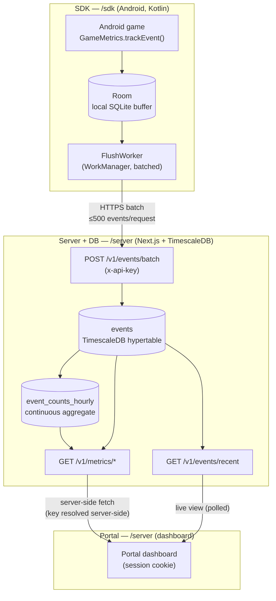
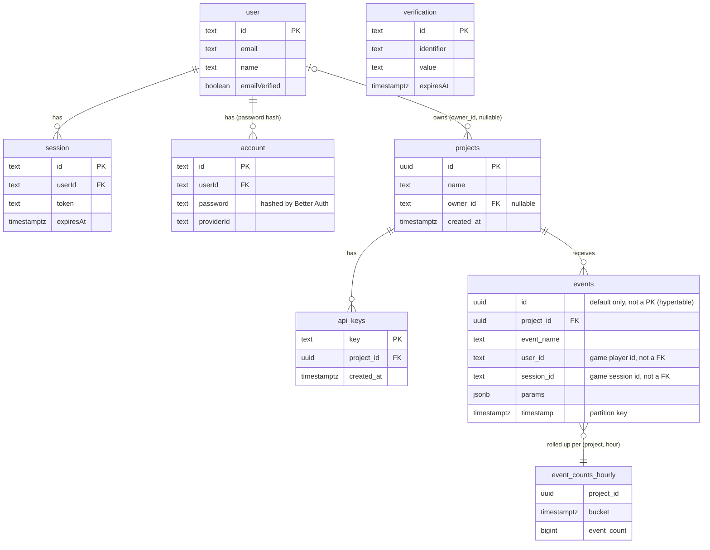
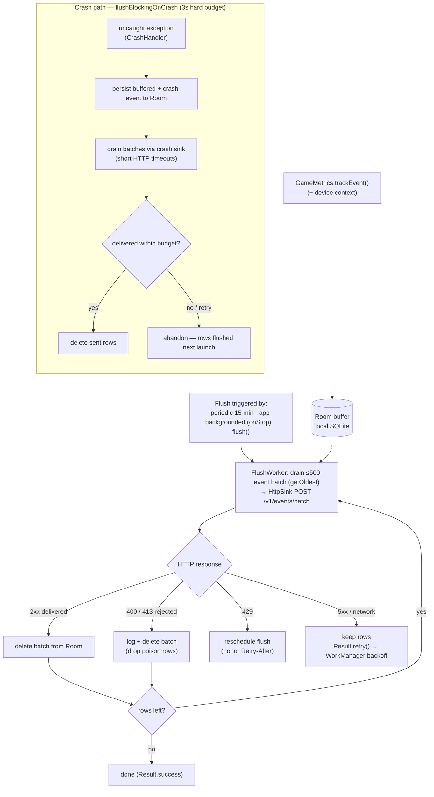

# GameMetrics — Architecture

This document explains how GameMetrics is put together and, where the design
made a non-obvious choice, *why*. It is written against the code in `/sdk` and
`/server`; file paths are cited so claims can be checked.

---

## 1. System overview

GameMetrics is a three-tier analytics system with a single direction of data
flow: events are produced on-device, ingested and stored server-side, and read
back by a dashboard.

1. **SDK (`/sdk`)** — an Android (Kotlin) library. The game calls
   `GameMetrics.trackEvent(...)`; events are written to a local Room/SQLite
   buffer and uploaded in batches by a background WorkManager job. Tracking never
   blocks the game thread and survives offline periods and process death.
2. **Server + database (`/server`)** — a Next.js (App Router) backend. It exposes
   an ingestion REST API (`/v1/events`, `/v1/events/batch`) and a read/metrics
   API (`/v1/metrics/*`, `/v1/events/recent`), all authenticated per-project by
   an `x-api-key` header. Events are stored in **TimescaleDB** (PostgreSQL 16)
   using a time-partitioned hypertable plus a continuous aggregate.
3. **Portal (`/server`, same Next.js app)** — a dashboard behind email/password
   auth (Better Auth). It renders overview stats, time-series charts, top events,
   and a real-time live-event view. For metric data it calls the same `/v1` REST
   API server-side rather than owning a second query path (see §7).

End-to-end flow:



---

## 2. Data model

The schema is defined across three migrations in `server/migrations/`
(`001_init.sql`, `002_realtime_agg.sql`, `003_auth.sql`), applied in order by
`scripts/migrate.ts`.

### Ingestion / analytics tables (`001_init.sql`)

- **`projects`** — `id UUID PK` (default `gen_random_uuid()`), `name TEXT`,
  `created_at TIMESTAMPTZ`. `owner_id TEXT` is added later by `003_auth.sql`
  (nullable, references `"user"(id)`) — this is what ties a project to a portal
  user.
- **`api_keys`** — `key TEXT PK` (default `encode(gen_random_bytes(24),'hex')`,
  i.e. a 48-char hex string), `project_id UUID NOT NULL REFERENCES projects(id)
  ON DELETE CASCADE`, `created_at`. A project may have more than one key; reads
  resolve "the" key as the oldest by `created_at` (`src/lib/portal.ts`).
- **`events`** — the fact table, a **TimescaleDB hypertable** partitioned on
  `timestamp` (`SELECT create_hypertable('events','timestamp')`). Columns:
  `id UUID` (has a default but is **not** a declared primary key — see the note
  below), `project_id UUID NOT NULL REFERENCES projects(id)`, `event_name TEXT`,
  `user_id TEXT` (nullable), `session_id TEXT` (nullable), `params JSONB`,
  `timestamp TIMESTAMPTZ`. Secondary indexes: `(project_id, timestamp DESC)` and
  `(event_name, timestamp DESC)`.
- **`event_counts_hourly`** — a continuous aggregate (materialized view) over
  `events`: `count(*)` grouped by `project_id` and `time_bucket('1 hour',
  timestamp)`. See §3.

> Note: `events.id` carries a `gen_random_uuid()` default but no `PRIMARY KEY`
> constraint. On a hypertable any unique constraint must include the
> partitioning column (`timestamp`), so there is no standalone PK on `id`; the
> column exists mainly to give each row a stable identifier (used by the live
> view's dedupe). Verified in `001_init.sql`.

### Portal auth tables (`003_auth.sql`)

Generated by Better Auth's CLI for the email/password configuration:
**`"user"`**, **`"session"`**, **`"account"`**, **`"verification"`**.
`session.userId` and `account.userId` both reference `"user"(id)` with
`ON DELETE CASCADE`. Hashed passwords live in `account.password` (Better Auth
writes them; see §8). These tables are entirely separate from the ingestion
tables — the only link between the two worlds is `projects.owner_id → "user".id`.

### Relationships (summary)



`verification` is a standalone Better Auth table (no FK to the others). Note that
`events.user_id` / `events.session_id` are **game-side** identifiers carried in
the payload — they are plain text, not foreign keys to the portal `user` /
`session` tables.

---

## 3. Storage strategy — and why

### Why a TimescaleDB hypertable for `events`

The event stream is an **append-heavy, time-ordered, analytical** workload:
writes are almost exclusively inserts of "now-ish" rows, and reads are almost
always "counts/aggregations over a time window for one project." A hypertable is
a good fit for this shape:

- **Time partitioning (chunks).** `create_hypertable('events','timestamp')`
  transparently splits the table into per-time-range chunks. Range-scoped reads
  (every metrics query filters `timestamp >= from AND timestamp <= to`) touch
  only the chunks overlapping the window instead of the whole table — chunk
  exclusion keeps query cost proportional to the range, not to total history.
- **Insert locality.** New events land in the most recent chunk, so the hot write
  path stays in a small, cache-friendly working set even as history grows.
- **Standard SQL / `pg`.** It's still PostgreSQL: the app talks to it with plain
  parameterized `pg` queries (no ORM), and TimescaleDB adds the time-series
  primitives (`time_bucket`, continuous aggregates) the metrics endpoints rely
  on.

The two secondary indexes — `(project_id, timestamp DESC)` and
`(event_name, timestamp DESC)` — match the two access patterns the raw table is
actually queried by: project-scoped time ranges, and event-name filters.

### Why the `event_counts_hourly` continuous aggregate

The dashboard's most frequent read is "how many events per bucket over this
range" for charts and totals. Answering that from raw `events` means scanning and
counting every row in the window on every request — fine for a demo, wasteful at
volume, and repeated work since the answer for any already-elapsed hour never
changes.

`event_counts_hourly` **pre-rolls** the per-`(project, hour)` counts once and
stores them, so a chart read scans a handful of hourly rows instead of thousands
of raw events. Concretely: a 7-day chart reads at most ~168 aggregate rows per
project rather than every event in those 7 days. Daily buckets are produced by
rolling the hourly rows up with `time_bucket('1 day', bucket)` — still reading
the small aggregate, not raw.

**Freshness.** A plain continuous aggregate only reflects data up to its last
scheduled materialization, so a query could silently miss up to the last hour+ of
events — unacceptable for a near-live dashboard. `002_realtime_agg.sql` sets
`timescaledb.materialized_only = false`, enabling **real-time aggregation**: the
view transparently `UNION`s the materialized buckets with an on-the-fly
aggregation of the raw tail. The read path gets both the speed of pre-rolled data
and up-to-the-second freshness, with no recency gap. (The refresh policy in
`001_init.sql` materializes on a 1-hour schedule with a 1-hour `end_offset`.)

---

## 4. Retrieval strategy — and why

The key decision: **not every read can or should use the aggregate.** The
aggregate only stores `count(*)` per `(project_id, hour)` — it has **no
`event_name`, `user_id`, or `session_id` dimension**, and its time granularity is
one hour. So each endpoint picks its source deliberately, trading exactness and
dimensionality against scan cost.

| Endpoint | Source | Why |
| --- | --- | --- |
| `GET /v1/metrics/timeseries` (no `event_name`) | `event_counts_hourly` | Pure bucketed counts — exactly what the aggregate stores. Fast path; hourly buckets read directly, daily buckets rolled up from hourly. |
| `GET /v1/metrics/timeseries` (`event_name=…`) | raw `events` | The aggregate has no per-event-name dimension, so slicing by event name must scan raw. |
| `GET /v1/metrics/overview` | raw `events` | Needs distinct users (DAU + total) and distinct sessions, which the count-only aggregate can't answer. `total_events` is computed from the **same** raw scan so all four figures are mutually consistent for an arbitrary (even sub-hour) window. |
| `GET /v1/metrics/events` (top events) | raw `events` | A per-`event_name` breakdown — a dimension the aggregate doesn't carry. |
| `GET /v1/events/recent` (live view) | raw `events` | Needs full per-row detail (id, ids, params) and sub-second ordering; an hourly count can't provide it. |

The tradeoff in one line: **use the aggregate when the question is "how many,
bucketed by time, for the whole project" (cheap, and the aggregate is exact for
that question); drop to raw `events` whenever the answer needs a dimension the
aggregate doesn't store (event name, distinct users/sessions) or finer-than-hour
precision.** `timeseries` reports which path it took in a `source:
"aggregate" | "events"` field on the response, so the choice is observable.

Every metrics query is scoped to a single `project_id` (resolved from the API
key) and bounded by a time range (`parseTimeRange`, default last 7 days, in
`src/lib/api.ts`), so even the raw-scan endpoints stay bounded by the
`(project_id, timestamp)` index and chunk exclusion.

> Note on wording: the aggregate path is often described as the "fast" path and
> raw as the "exact" path. With real-time aggregation enabled (§3) the aggregate
> is also *exact for a pure count* — the reason the other endpoints avoid it is
> missing **dimensions/precision**, not accuracy of the count itself.

---

## 5. Ingestion path

Two endpoints, one shared validator (`src/lib/events.ts` — `normalizeEvent`,
`readJsonBody`), so single and batch accept an identical event shape and enforce
identical limits (event-name ≤128 chars, ids ≤256, params ≤8 KB serialized).

- **`POST /v1/events`** (`src/app/v1/events/route.ts`) — a single event, one
  parameterized `INSERT`. Body cap 32 KB. Returns `201 { ok: true }`. Kept for
  simple/manual use (e.g. `curl`).
- **`POST /v1/events/batch`** (`src/app/v1/events/batch/route.ts`) — up to
  **500** events (`MAX_BATCH_EVENTS`) in one request, body cap 2 MB. This is the
  path the SDK uses.

### Single-round-trip `unnest` insert

The batch endpoint does **not** loop `INSERT`s. It passes the batch as six
parameters — `project_id` as a scalar plus five parallel arrays
(`event_name[]`, `user_id[]`, `session_id[]`, `params[]`, `timestamp[]`) — and
expands them server-side with `unnest`, casting each `params` text element to
`jsonb`:

```sql
INSERT INTO events (project_id, event_name, user_id, session_id, params, timestamp)
SELECT $1, e.event_name, e.user_id, e.session_id, e.params::jsonb, e.timestamp
FROM unnest($2::text[], $3::text[], $4::text[], $5::text[], $6::timestamptz[])
  AS e(event_name, user_id, session_id, params, timestamp)
```

One statement, one network round-trip, one plan — instead of N round-trips for N
events. Parameters are bound (never string-interpolated), so there is no
injection surface even though the row count varies.

### Whole-batch-atomic semantics — and why

Validation is **whole-batch-atomic**: every event is normalized first; if *any*
one is malformed, the endpoint returns `400` (with the offending index) and
writes **nothing**. A `201` therefore means *every* event in the batch was
stored. The reason is the client contract: the SDK deletes its local rows only on
success, so an all-or-nothing result lets it safely drop exactly the batch it
sent without reconciling a partial "some stored, some skipped" outcome. (Because
it's a single `INSERT` statement, the write is also atomic at the DB level.)

The SDK cooperates with this contract (`FlushWorker`, `GameMetricsClient`):

- It drains its local queue one `≤500`-event batch per request
  (`MAX_BATCH_SIZE = 500`, matching the server cap) via `EventDao.getOldest`.
- **`2xx` (Delivered):** delete those local rows.
- **`400`/`413` (Rejected):** a client bug that will never succeed as-is — log
  loudly and drop the rows so they can't wedge the queue forever.
- **`429` (Retry):** honor `Retry-After` and reschedule the flush.
- **`5xx`/network (Retry):** transient — keep the rows and retry later
  (WorkManager backoff).

A crash path (`flushBlockingOnCrash`) reuses the same batched sink under a hard
3-second wall-clock budget so a dying process flushes what it can without
hanging.



---

## 6. Ingestion input hardening

Because ingestion is public (anyone with a key can POST), the endpoints defend
before touching the DB: `Content-Length` is checked, then the actual body bytes,
against per-endpoint caps (413 on exceed); malformed JSON is 400; batch size is
capped at 500 (413). Rate limiting runs *before* auth so an invalid-key flood is
throttled too (§8).

---

## 7. Portal-as-API-client — single source of truth

The portal does **not** keep a second, parallel query layer for metrics. For
overview/top-events/timeseries/live data it calls the very same `/v1` HTTP API an
external integrator would (`src/lib/portal.ts` — `metricsFetch`,
`fetchRecentEvents`). The only thing it does differently: it resolves the
project's `x-api-key` **server-side** and attaches it to the request, so the key
never reaches client JavaScript.

Why: one implementation of every metric means one place for the query logic, the
validation, and the aggregate-vs-raw decision — the portal can't drift from what
the public API returns. The accepted tradeoff is an extra in-process HTTP hop
(loopback `fetch` with `cache: "no-store"`) versus calling the DB directly.

The live view adds a thin portal-internal proxy
(`/projects/:id/live/recent`) that the client polls; it does its own session +
ownership check and forwards to `/v1/events/recent`. That route is a deliberate
"transport seam" — polling could later be swapped for SSE without changing the
client's data shape.

> One exception, by design: **project listing and ownership checks read the DB
> directly** (`listProjects`, `getOwnedProject`), because those aren't metrics
> endpoints — they're the authorization layer that decides *which* project's key
> the portal is even allowed to use.

---

## 8. Two separate auth systems

GameMetrics runs two independent authentication systems because it has two
different callers with two different threat models:

| | Ingestion / metrics API | Portal |
| --- | --- | --- |
| Caller | Machines (game SDKs, integrators) | Humans (dashboard) |
| Credential | `x-api-key` header → resolves `project_id` (`src/lib/api.ts`) | Email/password → Better Auth session cookie |
| Scope | One project (the key's project) | One user and the projects they own |
| Routes | `/v1/*` | `/`, `/projects/*`, `/api/auth/*` |

Keeping them separate means the machine path never depends on human session
handling and vice versa: an API key is a long-lived per-project bearer secret
suitable for embedding in a game build, while a portal session is a short-lived,
revocable, DB-backed cookie for an interactive human. Neither can be used in the
other's place. The ingestion middleware matcher is deliberately narrow and
**never** touches `/v1/*` or `/api/auth/*`, so x-api-key ingestion is entirely
unaffected by portal auth (`src/middleware.ts`).

**Password hashing** is owned by Better Auth (`src/lib/auth.ts`): the app never
writes `user`/`account` rows by hand (even the demo seed goes through
`auth.api.signUpEmail`), and only the library-produced hash is stored in
`account.password`. Sessions are **database-backed** (the `session` table), not
JWT-only, so they are revocable — a 7-day expiry refreshed daily.

> Flag: the exact password-hashing algorithm is Better Auth's built-in default
> (this project does not override it in `auth.ts`). If the precise algorithm/params
> matter for a security review, confirm against the installed Better Auth version
> rather than assuming.

---

## 9. Security

- **Authorization lives in the data layer, not (only) middleware.** Per
  **CVE-2025-29927**, Next.js middleware auth gates can be bypassed, so
  middleware here is treated as an *optimistic redirect only* — it bounces
  cookie-less users to `/login` to save a render, and explicitly is "NOT the
  authorization boundary" (`src/middleware.ts`). Real enforcement is in the
  server components / route handlers / data layer: every protected page and
  portal route calls `requireUser()` and `getOwnedProject()` directly
  (`src/lib/portal.ts`). `getOwnedProject` returns a project **only** if the
  logged-in user owns it, and callers surface both "missing" and "not yours" as
  the same `404` so project existence isn't leaked across accounts.
- **Parameterized queries everywhere.** All DB access uses bound `pg`
  parameters; time ranges and ids are never interpolated into SQL. Project ids
  are additionally shape-checked against a UUID regex before the query so a
  malformed id can't even reach the cast.
- **Password hashing via Better Auth** (§8) — no hand-rolled crypto; hashes only,
  never plaintext.
- **Rate limiting** (`src/lib/rate-limit.ts`) — an in-memory sliding-window
  limiter. Ingestion is limited per **API key** and checked *before* auth/DB work
  so invalid-key floods are throttled cheaply (100 req/min default). The login
  endpoint (`/sign-in/email`) has a separate, stricter budget keyed per **client
  IP** (5 req/min default) since Better Auth does not brute-force protect it
  (`src/app/api/auth/[...all]/route.ts`).
- **Input hardening on ingestion** — size caps, JSON validation, batch-size cap
  (§6), and opt-in-only payload logging in the SDK (off by default, since full
  payloads can contain PII).

> Known limitation (documented in code): the rate limiter's state is
> per-process/in-memory, so it is correct for a single instance but does not
> coordinate across multiple instances or survive a restart. Moving to a shared
> store (e.g. Redis sorted-set sliding window) is the stated path for a
> multi-instance deployment.

---

## 10. Things to verify before relying on this doc

- **Password hash algorithm** — Better Auth default, not explicitly configured
  here (§8). Confirm against the pinned library version if it matters.
- **`events.id`** is intentionally not a primary key on the hypertable (§2);
  don't assume uniqueness is DB-enforced.
- **Single-instance assumptions** — the in-memory rate limiter (§9) and any other
  in-process state assume one server instance.
