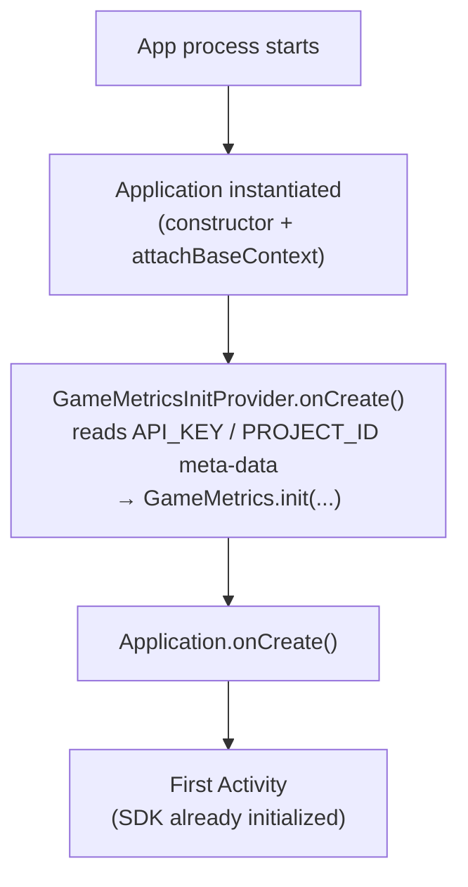
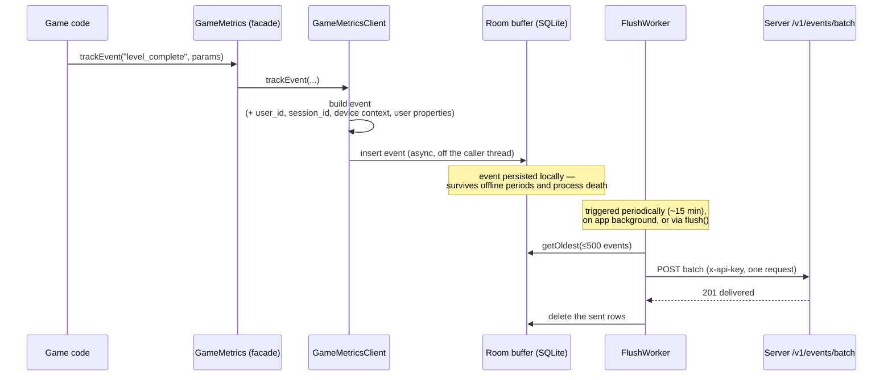

# GameMetrics — Android SDK

The GameMetrics Android SDK collects gameplay events on-device and uploads them
in batches to a GameMetrics server, with zero initialization code required in the
host app. This document is written against the Kotlin source in `/sdk`; every
signature and example is taken from the code.

Module coordinates: local Gradle module `:gamemetrics`, namespace
`com.gamemetrics`, `minSdk 24`, `compileSdk 36`, Java 11.

---

## Getting started

The SDK is currently a **local Gradle module**, not yet published to a Maven
repository. Integration is three steps: include the module, add your credentials
as manifest meta-data, and call `trackEvent`.

### 1. Include the module

```kotlin
// settings.gradle.kts
include(":gamemetrics")

// app/build.gradle.kts
dependencies {
    implementation(project(":gamemetrics"))
}
```

The library manifest already declares the `INTERNET` and `ACCESS_NETWORK_STATE`
permissions and registers the auto-init `ContentProvider`, so nothing else needs
to be added to your app manifest except your credentials.

### 2. Add your API key and project id as meta-data

Get these by creating a project in the GameMetrics portal (see `/server`). Place
the meta-data inside `<application>`:

```xml
<!-- app/src/main/AndroidManifest.xml, inside <application> -->
<meta-data
    android:name="com.gamemetrics.API_KEY"
    android:value="YOUR_API_KEY_HERE" />
<meta-data
    android:name="com.gamemetrics.PROJECT_ID"
    android:value="your-project-id" />
```

That is all the wiring the SDK needs — it auto-initializes at process start from
these values (see [Auto-initialization](#auto-initialization)). No `Application`
subclass and no manual `init()` call are required.

### 3. Track an event

```kotlin
import com.gamemetrics.GameMetrics

// Anywhere in your game, once the process has started:
GameMetrics.trackEvent("level_complete", mapOf("level" to 3, "score" to 9500))
```

Events are **not sent immediately** — they are buffered locally and uploaded in
batches by a background worker. See [Event lifecycle](#event-lifecycle) for what
happens next and when.

> Endpoint (dev default): the SDK ships pointing at
> `http://10.0.2.2:3000/v1/events/batch` — `10.0.2.2` is the Android emulator's
> alias for `localhost` on the host machine. The base URL is currently a
> compile-time constant (`HOST` in
> `internal/sink/HttpSink.kt`); there is no runtime override yet. Because the
> default is cleartext HTTP, the sample app allows it via a
> `networkSecurityConfig` — a production integration should target an HTTPS
> server.

---

## Public API reference

All public entry points are on the `GameMetrics` object
(`sdk/gamemetrics/src/main/java/com/gamemetrics/GameMetrics.kt`). With auto-init,
calling any tracking method before initialization throws `IllegalStateException`
with a message explaining the missing meta-data; in practice auto-init has
already run by the time your first Activity exists.

### `trackEvent`

```kotlin
fun trackEvent(name: String, params: Map<String, Any>? = null)
```

Record a custom event. `name` is the event name; `params` is an optional map of
event-specific properties. The SDK automatically attaches the current
`user_id`, the session id, the collected [device context](#device-context), and
any [user properties](#setuserproperty) before the event is stored.

```kotlin
GameMetrics.trackEvent("purchase", mapOf("sku" to "gold_500", "price" to 4.99))
GameMetrics.trackEvent("app_open") // params is optional
```

### `trackScreen`

```kotlin
fun trackScreen(screenName: String)
```

Convenience wrapper that records an event named `screen_view` with
`params = { "screen_name": screenName }`.

```kotlin
GameMetrics.trackScreen("main_menu")
```

### `setUserId`

```kotlin
fun setUserId(userId: String?)
```

Set (or clear, with `null`) the user identifier attached to **subsequent**
events as `user_id`. It is not applied retroactively to already-tracked events.

```kotlin
GameMetrics.setUserId("player_1")
```

### `setUserProperty`

```kotlin
fun setUserProperty(key: String, value: String)
```

Set a durable user property. The property is remembered for the rest of the
process and merged into **subsequent** events under `params.user_properties`
(alongside `context`), so it reaches the server with every event you track after
setting it. Setting the same key again overwrites it; properties are not applied
retroactively to already-tracked events.

```kotlin
GameMetrics.setUserProperty("plan", "premium")
GameMetrics.trackEvent("level_complete") // params.user_properties = { "plan": "premium" }
```

### `logException`

```kotlin
fun logException(throwable: Throwable)
```

Record a handled exception as an event named `exception`, with
`params = { "message": <message>, "stacktrace": <full stack trace> }`. This is
the same event the crash handler emits for uncaught exceptions.

```kotlin
try {
    riskyOperation()
} catch (e: Exception) {
    GameMetrics.logException(e)
}
```

### `flush`

```kotlin
fun flush()
```

Request an immediate upload of buffered events by enqueueing a one-time
`FlushWorker`. It is asynchronous — it schedules the work and returns; it does
not block or guarantee delivery by the time it returns (that still depends on
network availability). Normal operation does not require calling this; the SDK
flushes on its own (see [Event lifecycle](#event-lifecycle)).

```kotlin
GameMetrics.flush()
```

### `init` (optional)

```kotlin
fun init(
    context: Context,
    apiKey: String,
    projectId: String,
    loggingOnly: Boolean = false,
    debugLogPayloads: Boolean = false,
)
```

Manual initialization. Only needed if you disable auto-init (see below) or want
to supply credentials at runtime instead of via meta-data. `loggingOnly` routes
events to a logging sink instead of the network (useful in tests/dev);
`debugLogPayloads` logs full request bodies (off by default because payloads can
contain PII).

```kotlin
GameMetrics.init(context, apiKey = "…", projectId = "…")
```

---

## Auto-initialization

The SDK initializes itself before your code runs, which is what makes the
zero-init-code integration possible. It ships a `ContentProvider`
(`GameMetricsInitProvider`) declared in the library manifest with authority
`${applicationId}.gamemetricsinitprovider`. Android instantiates and calls
`onCreate()` on all installed content providers **after the `Application` object
is constructed but before `Application.onCreate()` runs** — so the provider is a
reliable, app-code-free hook to initialize at process start.

In `onCreate()` the provider reads the app's meta-data and, unless auto-init is
disabled, calls `GameMetrics.init(...)` with your `API_KEY` and `PROJECT_ID`. If
either value is missing or blank it logs a warning and skips init (it does not
crash the app).



### Opting out

To take over initialization yourself, disable auto-init with a boolean meta-data
flag and call `GameMetrics.init(...)` manually:

```xml
<meta-data
    android:name="com.gamemetrics.AUTO_INIT"
    android:value="false" />
```

Other recognized meta-data flags (both default to `false`):
`com.gamemetrics.LOGGING_ONLY` and `com.gamemetrics.DEBUG_LOG_PAYLOADS`.

---

## Event lifecycle

From your code's point of view a single call to `trackEvent` kicks off this path.
It is intentionally asynchronous and buffered.



**Buffering.** `trackEvent` never blocks the calling thread and never performs
network I/O inline. The event is enqueued and written to a local Room/SQLite
database (`gamemetrics-events`) on a background coroutine. Events tracked before
the database finishes opening are held in an in-memory queue and drained into the
database as soon as it is ready.

**Batching.** Uploads are done by `FlushWorker` (a WorkManager
`CoroutineWorker`). It drains the queue oldest-first, up to **500 events per
request** (the server's per-batch cap), and sends each batch as a single
`POST /v1/events/batch`. On a `2xx` the rows are deleted; the loop repeats until
the queue is empty.

**Flush timing.** A flush happens:
- **Periodically** — a unique periodic worker runs roughly every 15 minutes
  (WorkManager decides exact timing; it requires network connectivity).
- **On backgrounding** — when the app goes to the background
  (`ProcessLifecycleOwner` `onStop`), a flush is enqueued immediately.
- **On demand** — when you call `GameMetrics.flush()`.

Because of this, **events are not instant**: expect up to the periodic interval
of delay in the worst case (sooner if the app is backgrounded or you flush
manually). Design your analytics expectations around eventual, batched delivery.

**Offline persistence.** Events live in the on-device database until a batch is
confirmed stored, so they survive no-network periods, app restarts, and process
death. On a transient failure (network error or `5xx`), or a `429`, the rows are
kept and retried later (respecting a `Retry-After` hint on `429`); WorkManager
handles backoff. A batch the server rejects as a client error (`400`/`413`) is
logged and dropped so it can't wedge the queue forever.

**Device context.** At init the SDK collects a device/app context object **once**
and merges it into every event's `params` under a nested `context` key — the
developer passes none of it. See [below](#device-context) for the shape.

**User properties.** Any values set via `setUserProperty` are snapshotted at
track time and merged into the event's `params` under a `user_properties` key, so
they travel to the server with every subsequent event (see
[`setUserProperty`](#setuserproperty)).

**Crash-safe upload.** The SDK installs an uncaught-exception handler. On an
uncaught exception it records an `exception` event and **synchronously** flushes
pending events before the process dies (WorkManager's deferred flush would never
run once the process is being killed). This blocking flush is hard-capped at
**3 seconds** of wall-clock time (with short per-connection timeouts) so it can
never hang the dying process, then it chains to the previously installed handler
so the normal system crash dialog / other reporters still run. Anything it
couldn't send in the budget stays in the database and uploads on the next launch.

### Device context

Collected once at init and attached to every event under `params.context`
(verified shape, from `internal/context/DeviceContext.kt`):

```json
"context": {
  "device":  { "model": "Pixel 7", "manufacturer": "Google" },
  "os":      { "release": "14", "sdk_int": 34 },
  "app":     { "version_name": "1.0", "version_code": 1 },
  "screen":  { "width": 1080, "height": 2400, "density": 2.75 },
  "locale":  "en-US",
  "network": "wifi" | "cellular" | "none"
}
```

`network` reflects connectivity **at init time only**, since the context is
captured once. Context collection is best-effort — if it fails it is logged and
tracking continues.

---

## Internal architecture (brief)

- **Facade / client split.** `GameMetrics` (public object) is a thin facade that
  delegates to a single internal `GameMetricsClient`, which owns session id,
  current user id, the event buffer, WorkManager scheduling, and the crash
  handler.
- **Room.** Events are persisted in a Room database (`EventEntity` /
  `EventDao`), queried oldest-first and deleted by id after a confirmed send.
- **WorkManager.** `FlushWorker` performs the batched uploads (periodic +
  expedited one-time for immediate/backgrounded/retry flushes).
- **Sinks.** An `EventSink` abstracts delivery: `HttpSink` posts a batch to
  `/v1/events/batch` and maps the response to `Delivered` / `Rejected` /
  `Retry`; `LoggingSink` is the `loggingOnly` no-network alternative.

The server-side ingestion contract these cooperate with — the single-round-trip
`unnest` insert and whole-batch-atomic `201`/`400` semantics — is documented in
[architecture.md §5](./architecture.md#5-ingestion-path).

---

## See also

- [architecture.md](./architecture.md) — full system architecture; **§1** (SDK
  tier / data flow), **§5** (ingestion path and SDK ↔ server contract).
- [api-reference.md](./api-reference.md) — the REST API the SDK posts to
  (`/v1/events/batch`).
- `/sdk/app` — a runnable sample app exercising every public method (including a
  forced-crash button that demonstrates the crash-safe upload path).
